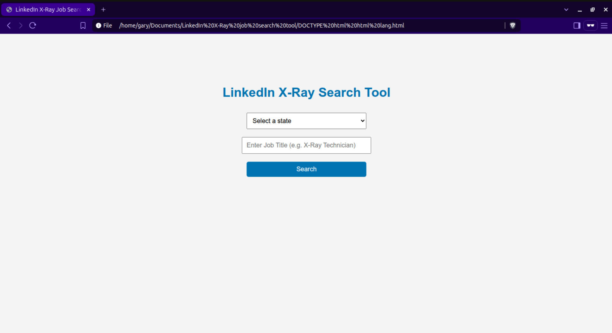
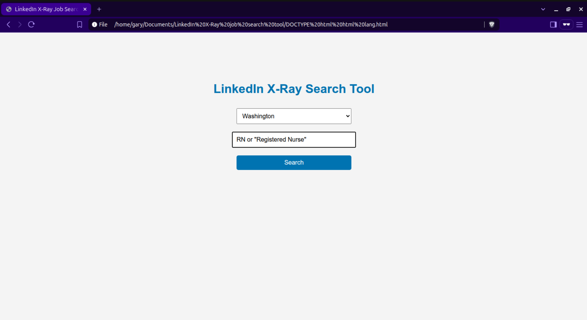
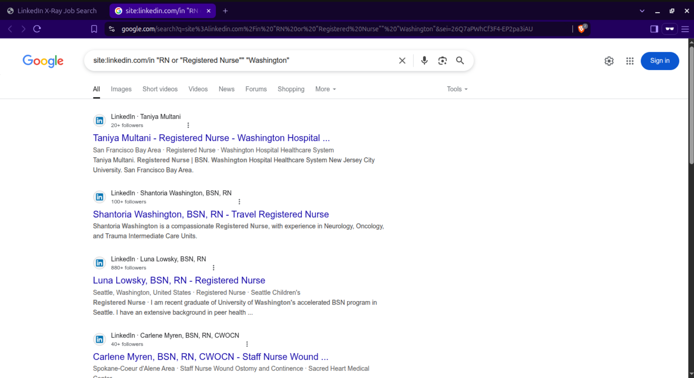

# 🔍 LinkedIn X-Ray Search Tool

A simple web tool that allows users to perform advanced Google X-Ray searches to find LinkedIn profiles by **job title** and **US state** — no LinkedIn login required.

## 📌 Features

- Select any of the 50 US states from a dropdown
- Enter any job title (e.g., "X-Ray Technician", "Software Engineer")
- Click "Search" to open a Google X-Ray search for relevant LinkedIn profiles

## Home Page

## Home Page with Values

## Output

@gauravmazumder19
